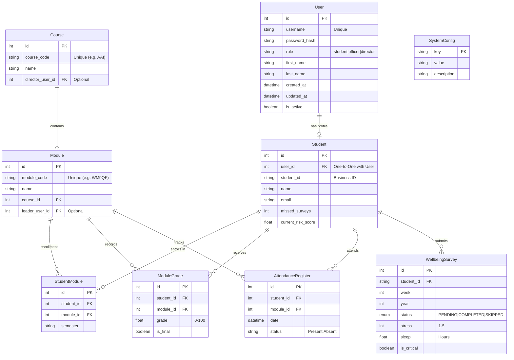
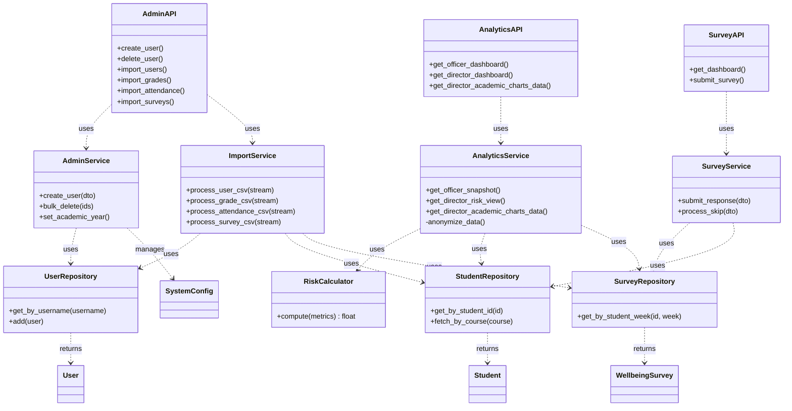
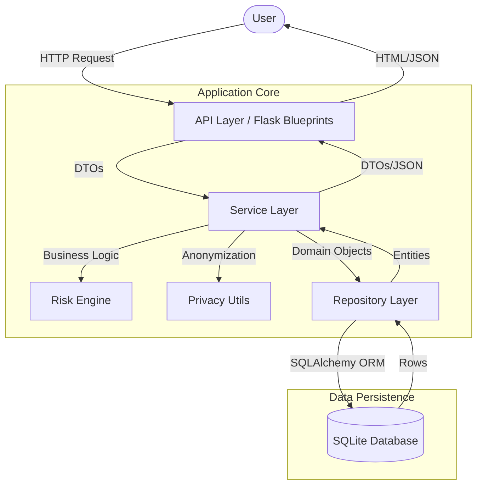

# System Architecture

## 1. High-Level Overview

The Student Wellbeing & Academic Tracking System (SWATS) is a monolithic web application designed to monitor student wellbeing and academic performance. It is built using **Python (Flask)** and follows the **Model-View-Controller (MVC)** architectural pattern.

The system emphasizes:
-   **Separation of Concerns**: Clear boundaries between Data (Models), Logic (Services), and Presentation (Templates).
-   **Privacy by Design**: Strict data access controls and anonymization for different user roles.
-   **Testability**: Dependency Injection allows for easy mocking and high test coverage.

### 1.1. Monolithic Architecture
SWATS is built as a **Monolith**, meaning all functional components (User Management, Analytics, Surveys) reside in a single codebase and are deployed as a single unit.
-   **Why Monolith?**: For a system of this scale (university prototype), a monolith offers the simplest deployment model, easiest debugging, and zero network latency between components. It avoids the distributed system complexity of microservices (e.g., eventual consistency, service discovery) which is unnecessary at this stage.

### 1.2. MVC Pattern
The application strictly follows the **Model-View-Controller** pattern:
-   **Model (`src/models/`)**: Represents the data structure (e.g., `Student`, `Survey`). These are "dumb" objects that hold data and have minimal logic.
-   **View (`src/templates/`)**: The User Interface. In Flask, these are Jinja2 templates that render HTML dynamically based on data provided by the Controller.
-   **Controller (`src/api/`)**: The entry point for requests. It accepts user input, calls the appropriate **Service** (Business Logic), and selects the **View** to render.

## 2. Technology Stack

| Component | Technology | Version | Rationale |
| :--- | :--- | :--- | :--- |
| **Backend** | **Flask** | 3.x | Micro-framework offering flexibility and explicit control over dependencies. |
| **Database** | **SQLite** | 3.x | Serverless, zero-config database ideal for prototyping and embedded deployments. |
| **ORM** | **SQLAlchemy** | 2.x | Enterprise-grade ORM providing database agnosticism and robust relationship management. |
| **Templating** | **Jinja2** | 3.x | Powerful server-side rendering engine with inheritance and sandboxed execution. |
| **Auth** | **Flask-Login** | 0.6.x | Robust session management for stateful web UI authentication. |
| **Security** | **Bcrypt** | 4.x | Industry-standard password hashing algorithm. |
| **Testing** | **Pytest** | 7.x | Advanced testing framework with fixtures and parameterized testing support. |

## 3. Data Architecture (ERD)

The following Entity Relationship Diagram (ERD) represents the complete database schema, normalized to 3NF.

### 3.1. Entity Relationships Explained
-   **User & Student (1:1)**: The `User` table handles authentication (username/password), while the `Student` table holds domain-specific data (risk scores, misses). They are linked 1:1, allowing us to separate Auth concerns from Domain concerns.
-   **Course & Module (1:N)**: A `Course` (e.g., "Applied AI") contains multiple `Modules` (e.g., "Programming", "Ethics"). This hierarchical structure organizes the academic data.
-   **Student & Module (M:N)**: The `StudentModule` table is an associative entity resolving the Many-to-Many relationship between Students and Modules. It stores enrollment-specific data like the `semester`.
-   **Wellbeing Data**: `WellbeingSurvey` is linked directly to `Student`. The `is_critical` flag allows for efficient querying of at-risk students without scanning the entire survey history.

## 4. Application Architecture (UML Class Diagram)

This Class Diagram illustrates the relationships between the API Controllers, Services, Repositories, and Models.

### 4.1. Component Interactions Explained
-   **API Layer (Controllers)**: Classes like `AdminAPI` are thin wrappers. They do **not** contain business logic. Their job is to parse the HTTP request, extract data, and pass it to the Service Layer.
-   **Service Layer (Business Logic)**: This is the heart of the application. `AnalyticsService`, for example, orchestrates data retrieval from repositories, calls the `RiskCalculator`, and uses the `Anonymizer` to enforce privacy rules. It knows *what* to do, but not *how* to store it.
-   **Repository Layer (Data Access)**: Classes like `UserRepository` handle the *how*. They translate high-level requests ("Get user 'bob'") into SQL queries. This isolation means the Service layer never sees SQL code.
-   **Dependency Injection**: The `Container` wires these layers together. `AdminService` doesn't create a `UserRepository`; it asks the `Container` for one. This makes testing easy—we can give `AdminService` a fake repository that returns test data.

## 5. Data Flow Architecture

The system follows a strict unidirectional data flow for write operations and a layered retrieval for read operations.

### Data Flow Explanation

1.  **Input Processing**:
    -   Requests enter via **Flask Blueprints** (`src/api/`).
    -   Input validation occurs here (e.g., checking if `stress` is between 1-5).
    -   Data is converted into **DTOs** (Data Transfer Objects) to decouple the API from internal models.

2.  **Business Logic Execution**:
    -   **Services** receive DTOs.
    -   **AdminService**: Handles user lifecycle and system configuration.
    -   **SurveyService**: Checks if a survey is critical (Stress > 4) and triggers flags.
    -   **AnalyticsService**: Aggregates data. Crucially, it uses the `Anonymizer` utility to hash IDs if the requester is a Director, ensuring privacy compliance.

3.  **Data Persistence**:
    -   **Repositories** abstract the database. They translate Domain Entities into SQLAlchemy models.
    -   **Transactions**: Operations are wrapped in database transactions to ensure atomicity (e.g., creating a User and Student profile simultaneously).

4.  **Output Rendering**:
    -   Data flows back up the stack.
    -   **Jinja2 Templates** render the final HTML using the data provided by the API layer.

## 6. Security Architecture

### 6.1. Authentication (AuthN)
-   **Session-Based**: Uses `Flask-Login` for browser sessions.
-   **Password Security**: Passwords are hashed using `bcrypt` with a work factor ensuring resistance to rainbow table attacks.
-   **Token-Based**: `PyJWT` is used for API-only endpoints (future-proofing for mobile apps).

### 6.2. Authorization (AuthZ)
-   **Role-Based Access Control (RBAC)**: Custom decorators (`@role_required('admin')`) enforce permissions at the route level.
-   **Data-Level Security**:
    -   **Officers**: Can see PII (Names, IDs) for intervention.
    -   **Directors**: See **Anonymized** data only. The `Anonymizer` service hashes IDs and redacts names before data leaves the Service layer.

## 7. Testing Strategy

We follow the **Testing Pyramid**:

1.  **Unit Tests** (70%):
    -   Test individual classes (Services, Models) in isolation.
    -   **Mocking**: Repositories are mocked to avoid DB hits.
    -   *Location*: `tests/unit/`

2.  **Integration Tests** (20%):
    -   Test interactions between Service and Repository layers.
    -   Uses an **In-Memory SQLite** database.
    -   *Location*: `tests/integration/`

3.  **System/E2E Tests** (10%):
    -   Test full user flows (Login -> Dashboard -> Submit).
    -   Uses `FlaskClient` to simulate HTTP requests.
    -   *Location*: `tests/e2e/` & `tests/system/`
    -   **Coverage**: The project maintains **100% test coverage** across all layers, verified via `pytest-cov`.

